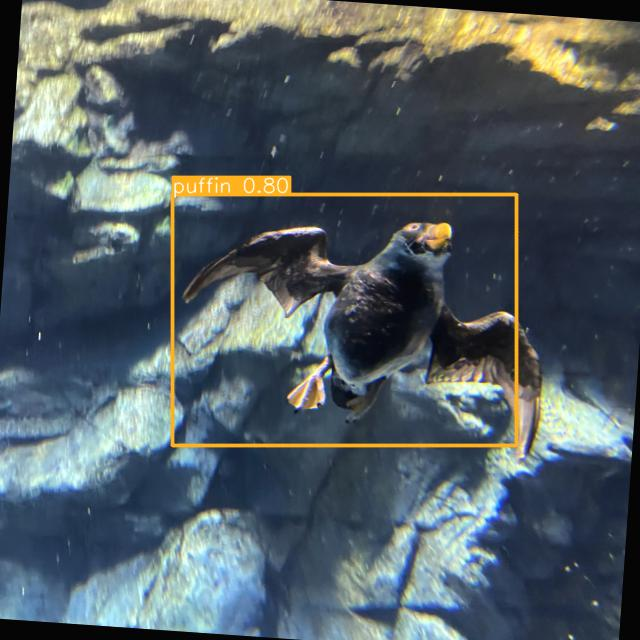

# Yolov5 deploy for aquarium dataset 


## Table of Contents

- [About](#about)
- [Getting Started](#getting_started)
- [Deployment](#deployment)

## About <a name = "about"></a>

Obtain object value out of image using YOLOV5.and return image and json result
trained on fish, jellyfish, penguins, sharks, puffins, stingrays, and starfish

## Getting Started <a name = "getting_started"></a>

[APP_LINK](http://ec2-54-152-8-85.compute-1.amazonaws.com/docs)

[deployment](#deployment) for notes on how to deploy the project on a live system.


## Deployment <a name = "deployment"></a>

 Deploying to AWS EC2

Log into your AWS account and create an EC2 instance (`t2.micro`), using the latest stable
Ubuntu Linux AMI.

[SSH into the instance](https://aws.amazon.com/blogs/compute/new-using-amazon-ec2-instance-connect-for-ssh-access-to-your-ec2-instances/) and run these commands to update the software repository and install
our dependencies.

```bash
sudo apt-get update
sudo apt install -y python3-pip nginx
```

Clone the FastAPI server app (or create your `main.py` in Python).

```bash
git clone https://github.com/pk1308/aquarium_yolov5_fastapi.git
```

Add the FastAPI configuration to NGINX's folder. Create a file called `fastapi_nginx` (like the one in this repository).

```bash
sudo vim /etc/nginx/sites-enabled/fastapi_nginx
```

And put this config into the file (replace the IP address with your EC2 instance's public IP):

```
server {
    listen 80;   
    server_name <YOUR_EC2_IP>;    
    location / {        
        proxy_pass http://127.0.0.1:8000;    
    }
}
```


Start NGINX.

```bash
sudo service nginx restart
```

Start FastAPI.

```bash
cd aquarium_yolov5_fastapi
pip3 install -r requirements.txt
python3 -m uvicorn main:app
```
